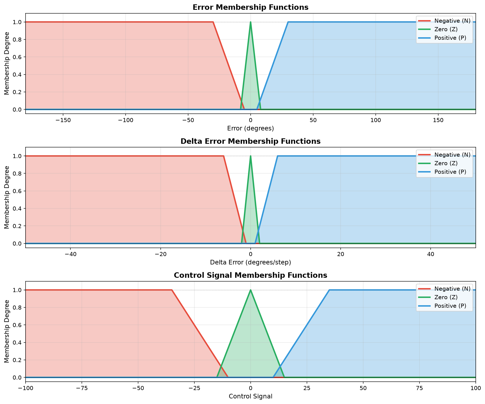
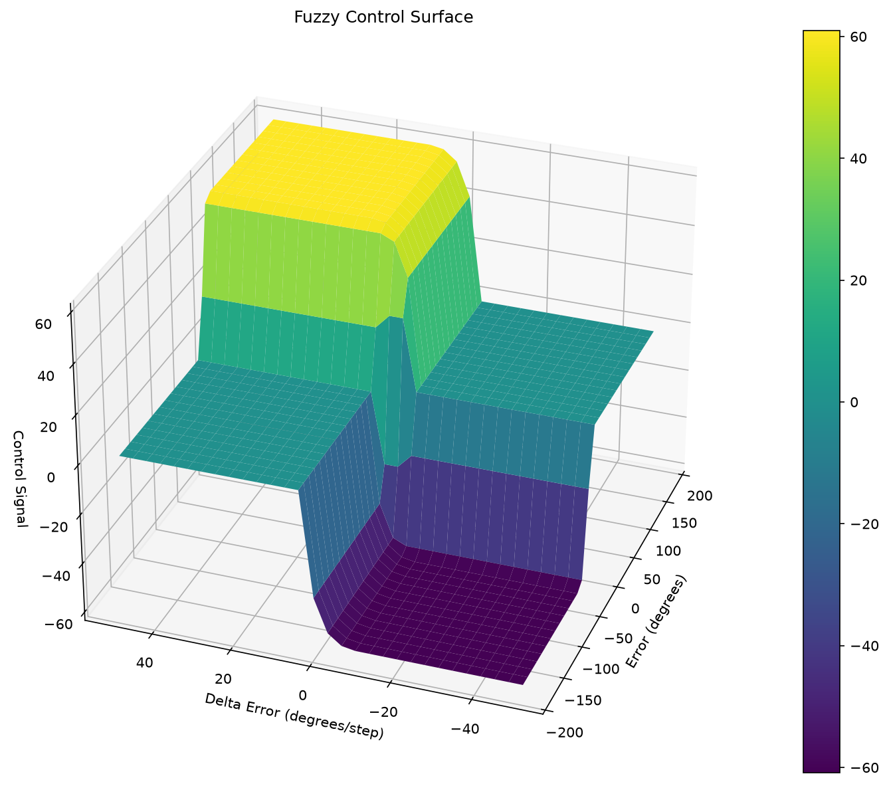
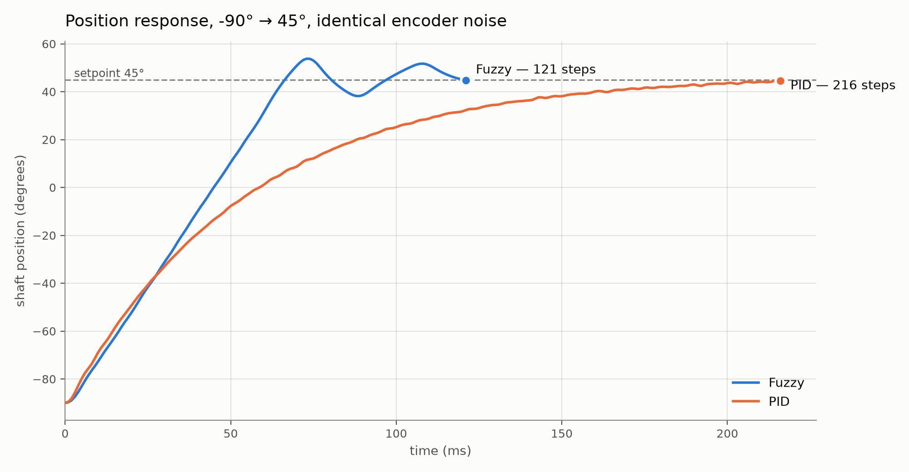
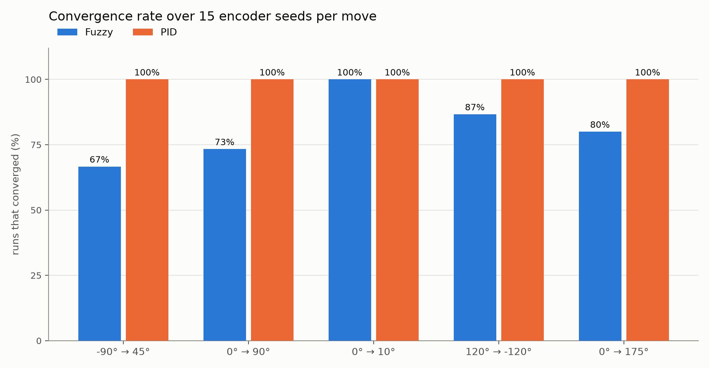

# Nine Rules and a DC Motor

**Building a fuzzy position controller from scratch, and measuring it honestly against PID.**

---

A PID controller is three numbers. You tune them, and the motor either behaves or it doesn't, and
when it doesn't you're mostly guessing which of the three to nudge.

A fuzzy controller is a table of sentences. *If the error is positive and it's shrinking, ease off.*
You write down how you'd drive the thing by hand, and the controller interpolates between those
sentences. That's the appeal — the tuning is legible.

I built a simulation to find out whether the appeal survives contact with a real plant model. It
has a DC motor, a noisy encoder, a fuzzy controller, a PID controller as the baseline, and enough
tests to keep me honest.

## The motor is not a shortcut

The plant is a real second-order model, not a first-order stand-in:

- *Electrical:* `L·di/dt + R·i = V − K_b·ω`
- *Mechanical:* `J·dω/dt = K_m·i − K_f·ω`
- *Kinematic:* `dθ/dt = ω`

Back-EMF couples the two — the faster the shaft spins, the less current the same voltage pushes.
With `J = 3.2 µkg·m²`, `R = 4 Ω`, `L = 1 mH` and `K_m = K_b = 0.03`, the steady state works out to
about 32.8 rad/s per volt.

The interesting part is the integration. The control loop runs at 1 kHz, and my first instinct was
to advance the physics by one millisecond per control step. That diverges. The electrical time
constant is `L/R = 250 µs`, and explicit Euler is only stable while the step stays under it — a 1 ms
step is four times too coarse and the current oscillates its way to infinity.

So each control period is integrated in 10 substeps of 100 µs. It's a two-line fix that's invisible
in the output when it's right and catastrophic when it's wrong, which is exactly the kind of thing
that gets "simplified away" six months later. There's a test asserting both halves: that 100 µs is
stable and that 1 ms is not.

## The encoder lies, on purpose

Feeding the controller the true shaft angle would make everything work beautifully and prove
nothing. The simulated encoder does what a real one does:

- **Quantization** — 1000 pulses per revolution, so 0.36° per count. Positions snap to that grid.
- **Noise** — Gaussian, σ = 0.1° by default, drawn from an injectable random generator.

That generator matters more than it sounds. Every run takes a seed, so a run is exactly
reproducible — which is what makes the golden-trace tests possible, and what let me do the
measurement at the end of this article.

## Nine rules

Error, change-in-error, and control output are each carved into three fuzzy sets: Negative, Zero,
Positive. Three by three gives nine rules.



Note how narrow **Zero** is on the error axis — a triangle spanning roughly ±8°, against Negative
and Positive that run all the way out to ±180°. Remember that shape; it comes back at the end.

Each step, the controller fuzzifies the two inputs (how much does this error belong to each set?),
fires all nine rules, and defuzzifies the aggregate back into one number in ±100. Plot that mapping
over the whole input space and you get the controller's entire personality in one surface:



That's the thing a PID can't give you. A PID is a plane — output is linear in its inputs, by
construction. This is a shaped landscape, and every ridge in it traces back to a sentence I wrote.

Pure inference does leave a steady-state offset, though: near the setpoint every rule says "Zero,"
so the output collapses toward zero while a small error remains, and the motor stops short. I add a
clamped integral term (`Ki = 0.5`, limited to ±300) on top of the defuzzified output to take that
last fraction of a degree out. Which is worth saying plainly: the fuzzy controller needed a piece of
the PID to finish the job.

## Then I ran it 75 times

One run, `-90° → 45°`, both controllers, the same encoder seed:



The fuzzy controller gets there in 121 steps and the PID takes 216 — nearly twice as long. That's a
genuine win, and it's the shape you'd hope for: fuzzy commits to full effort while the error is
large, then backs off. The PID's cautious approach is the price of never overshooting.

But one run is one seed. So I swept five moves against fifteen encoder seeds each — 150 runs — and
counted how often each controller actually reached the convergence band (`|error| < 0.5°` and
settled) inside the 300-step cap:



**PID converged in every single run. The fuzzy controller managed 81%.** When it misses, it
overshoots, stalls about 5° past the setpoint, and sits there until the step limit ends the run.

Look back at those membership functions and the reason is sitting right there. My fuzzy sets are
defined in **absolute degrees** — the Zero set is ±8° regardless of whether the move is 10° or 175°.
On a 10° move the initial error is already outside Zero, so the controller commands near-full effort
for a tiny motion and sails past. On that move it overshoots by 83% of the step size. The PID, whose
gains scale with the error by construction, handles it with no overshoot at all.

So the honest summary is narrower than "fuzzy beats PID": **the fuzzy controller is about twice as
fast when it converges, and it converges four times out of five.** For a positioning system, an 81%
success rate is not a shipping product — it's a diagnosis. The sets need to scale with the commanded
move, and that's the next version.

## Keeping myself honest

The measurement above only means something because the simulation is deterministic given a seed.
The repository has around 200 tests at roughly 98% coverage — unit tests per module, integration
tests over the closed loop and the CLI, and golden-trace tests that pin whole trajectories so a
"harmless" refactor can't quietly move the physics.

Everything tunable lives in frozen, self-validating dataclasses, so an out-of-range parameter fails
at construction rather than halfway through a run. Adding a controller means implementing three
methods; the simulation runner never learns its name.

## Tools

Python 3.10+, NumPy, matplotlib, pytest with a coverage gate, ruff, mypy, pre-commit, and a GitHub
Actions pipeline that derives the version from Conventional Commits and publishes to PyPI.

```
pip install dc-motor-fuzzy-sim
dc-motor-sim -90 45 --controller fuzzy --seed 42
```

## Links

- **Repository:** https://github.com/Ricsi1231/DC-Motor-Postion-Control-Fuzzy-Simulation
- **PyPI:** https://pypi.org/project/dc-motor-fuzzy-sim/

MIT licensed. Both comparison figures are produced by a script in the repository from live
simulation runs, so the numbers in this article can be reproduced with one command.
